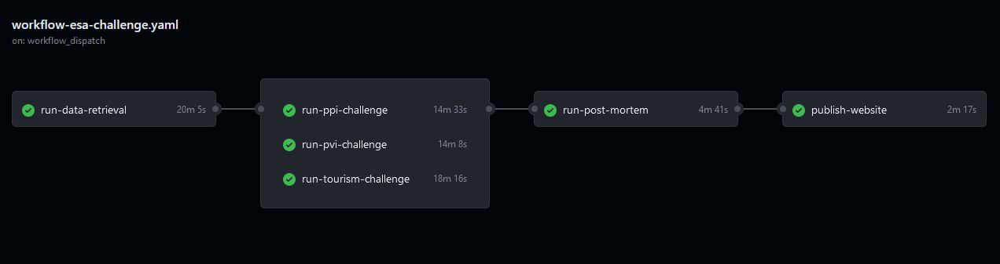

# Repository of the Insee team competing for the [European Statistics Awards for Nowcasting](https://statistics-awards.eu/)

[](https://joinup.ec.europa.eu/collection/eupl/eupl-text-eupl-12)
[](https://datalab.sspcloud.fr/launcher/ide/rstudio?autoLaunch=false&service.image.custom.enabled=true&service.image.custom.version=%C2%ABinseefrlab%2Fesa-nowcasting-2023%3Av10.0.0%C2%BB&onyxia.friendlyName=%C2%ABesa_nowcasting%C2%BB&init.personalInit=%C2%ABhttps%3A%2F%2Fraw.githubusercontent.com%2FInseeFrLab%2FESA-Nowcasting-2023%2Fmain%2Fsetup.sh%C2%BB)
[](https://github.com/InseeFrLab/ESA-Nowcasting-2023/actions/workflows/workflow-esa-challenge.yaml)

## Getting Started

To ensure full reproducibility of the results, the project is accompanied by a [Docker image](https://hub.docker.com/r/inseefrlab/esa-nowcasting-2023) that contains all the necessary packages and dependencies. You can pull the Docker image using the following command in your terminal:

```
docker pull inseefrlab/esa-nowcasting-2023:latest
```

Alternatively, you can use the [Onyxia instance SSPCloud](https://github.com/InseeFrLab/onyxia-web), a datalab developed by the French National Institute of Statistics and Economic Studies ([INSEE](https://www.insee.fr/fr/accueil)) that provides an easy-to-use interface for running the Docker image.

To get started with SSPCloud:

- Step 0: Go to [https://datalab.sspcloud.fr/home](https://datalab.sspcloud.fr/home). Click on **Sign In** and then **Create an account** with your academic or institutional email address.
- Step 1: Click [here](https://datalab.sspcloud.fr/launcher/ide/rstudio?autoLaunch=false&service.image.custom.enabled=true&service.image.custom.version=%C2%ABinseefrlab%2Fesa-nowcasting-2023%3Av10.0.0%C2%BB&onyxia.friendlyName=%C2%ABesa_nowcasting%C2%BB&init.personalInit=%C2%ABhttps%3A%2F%2Fraw.githubusercontent.com%2FInseeFrLab%2FESA-Nowcasting-2023%2Fmain%2Fsetup.sh%C2%BB) or on the orange badge on top of the page.
- Step 2: **Open** the service and follow the instructions regarding *username* and *credentials*.
- Step 3: **Open a new project** by clicking the following file: `~/work/ESA-Nowcasting-2023/ESA-Nowcasting-2023.Rproj`.
- Step 4: Ensure all necessary packages are installed by executing the ```renv::restore()``` command in the console. If prompted to proceed with the installation, enter `y`.

You are all set!

## Codes

### Functions

All functions used in the project are organized by theme in the ```R/``` folder :

```
ESA-Nowcasting-2023
└─── R
     │ data_preprocessing.R
     │ data_retrieval.R
     │ dfms_functions.R
     │ ets_functions.R
     │ lstm_functions.R
     │ post_mortem_functions.R
     │ regarima_functions.R
     │ saving_functions.R
     │ XGBoost_functions.R

```
### Configuration files

The project is composed of three configuration files that enable the operation of the models and the challenges as a whole. The first file, `challenges.yaml`, contains information about the challenges themselves, including the countries used for each challenge and the current dates.

The second file, `models.yaml`, is the backbone of the project as it contains all of the parameters used for all the models and challenges. This file is responsible for ensuring that the models are appropriately tuned. Any adjustments made to this file can have a significant impact on the accuracy of the models, and thus it is vital that the parameters are fine-tuned carefully.

Finally, the `data.yaml` configuration file is responsible for specifying all the relevant information about the data sources used in the challenge. It is essential that this file is accurately updated as changes to data sources or updates can have a significant impact on the accuracy of the models.

### Pipelines

The project is deeply relying on the [target package](https://books.ropensci.org/targets/), which is a tool for creating and running reproducible pipelines in R. `target` is particularly useful for managing large or complex data sets, as it allows you to define each task in a pipeline as a separate function, and then run the pipeline by calling the ```targets::tar_make()``` function. This ensures that tasks are run in the correct order, and can save time by only running tasks that are out of date or have not been run before.

The project is decomposed into four different pipelines specified in the targets_yaml file:

    - data: `run_data.R`
    - ppi: `run_ppi.R`
    - pvi: `run_pvi.R`
    - tourism: `run_tourism.R`

The first pipeline retrieves all the data necessary for the different challenges, while the other three run the five models for each challenge independently. Each pipeline can be run using the following command: `targets::tar_make(script = "run_***.R")`.

Note that the data used for the challenges is stored in a private bucket, and writing permissions are required to run the pipeline as is. Hence, if you don't have access to our private bucket you have to run all 4 pipelines with the parameter `SAVE_TO_S3` equals to `False`. 



### Website

The project automatically generates a website at the end of a pipeline run, which can be found in the `website/` folder. The website provides detailed information about the methodology used, the data sources employed, and the performance of the different models. The website is built using [Quarto](https://quarto.org/), an open-source tool for scientific documents and reports. You can access the website at https://inseefrlab.github.io/ESA-Nowcasting-2023/ and explore the various sections to learn more about our approach and results.

## Licence

This work is licenced under the [European Union Public Licence 1.2](https://joinup.ec.europa.eu/collection/eupl/eupl-text-eupl-12).
